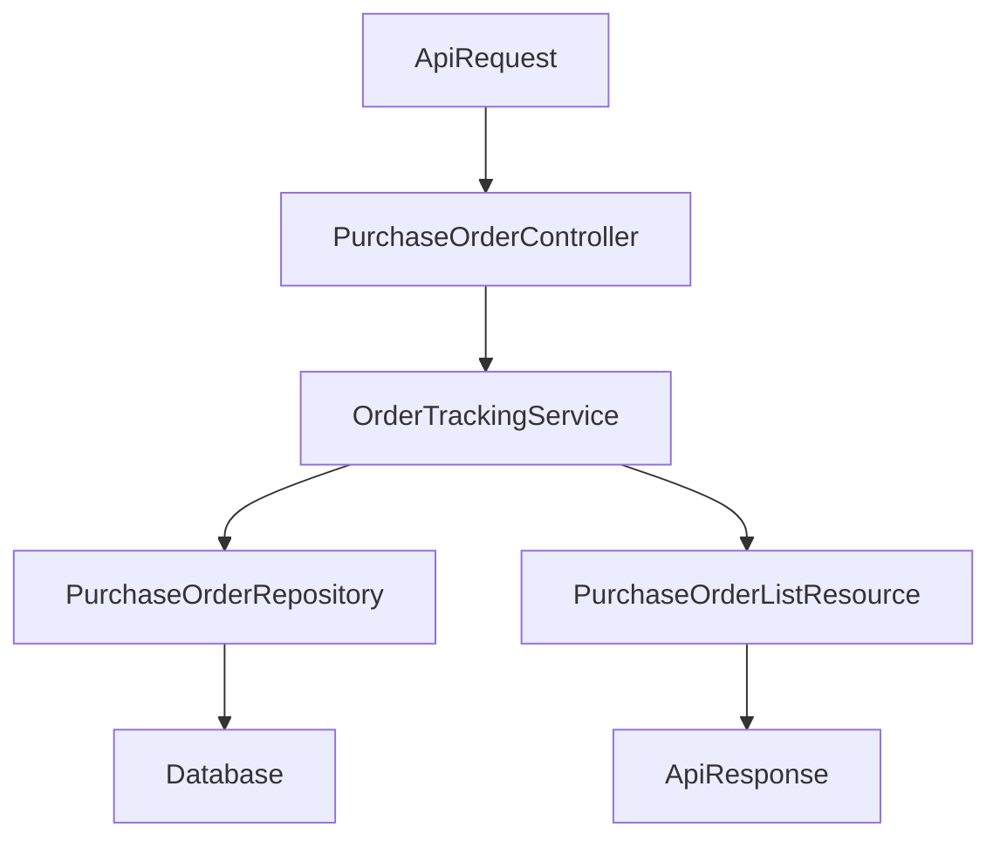

## Modules N+1 & Concurrency Review Plan

### 1. Confirm scope and constraints

- **Scope modules**: `Modules/Shift`, `Modules/Purchase`, `Modules/RecurringOrder`, `Modules/Expense`, `Modules/Inventory`, `Modules/Custody`, `Modules/Supplier`.
- **Behavior constraint**: Per spec `specs/001-modules-n1-query/spec.md`, make **no changes** to production HTTP responses, business rules, or database schema; work is **analysis and documentation only**.
- **Report format**: Follow the structure defined in `[specs/001-modules-n1-query/contracts/review-report.md](specs/001-modules-n1-query/contracts/review-report.md)` (Metadata, Scope, Executive Summary, Findings by Module, Cross-Cutting Concerns, Recommended Roadmap, Appendices).

### 2. Map entrypoints and data flows per module

- For each module, scan `app/Http/Controllers`, `app/Services`, `app/Repositories`, `app/Models`, `app/Jobs`, and `app/Console` to identify:
  - Main **HTTP entrypoints** (controller actions) and any **console commands/jobs** that hit the database heavily.
  - The **service layer** classes used by those entrypoints.
  - The **repositories/models** used by those services.
- Produce a concise per-module summary of the most critical flows (e.g., listing endpoints, reports, batch jobs) that are likely to stress the database.
- Optionally represent one or two complex flows (e.g., Purchase history listing or Inventory monthly report) with a mermaid diagram to clarify the call chain:

### 3. N+1 and slow query review

- For each module’s high-usage endpoints and jobs identified in step 2:
  - Inspect repositories and services for **Eloquent query patterns** that may cause N+1 queries (e.g., accessing relations inside loops without `with()` or `load()`).
  - Check for heavy `all()`/`get()` calls on large tables without filters, pagination, or chunking.
  - Look at **transformers/resources** under `app/Transformers` that access related models; verify that upstream code eager loads those relations.
  - Identify **slow or complex queries** (large joins, aggregate queries, subqueries) and note where indexes may be required, without proposing actual schema changes in this feature.
- Document for each finding: module, file, method, query/relationship, and why it is a risk (performance or memory).

### 4. Locks, transactions, and connection pool risks

- Grep/search across the repo for transaction and lock primitives (`DB::transaction`, `lockForUpdate`, `selectForUpdate`, long-running jobs, large exports).
- Within the target modules, review services, jobs, and listeners that wrap multiple writes in transactions:
  - Ensure transactions are scoped as narrowly as possible, and note any **long-lived transactions** that involve external calls or heavy loops.
  - Identify any use of explicit locking that might create **deadlock hotspots** or block concurrent requests.
- Analyze batch jobs and console commands for patterns that could exhaust the **database connection pool** (e.g., parallel jobs all holding open transactions, or lack of chunking/pagination).
- Summarize concrete examples per module, class, and method, categorizing them under "locks/deadlocks" or "connection pool" risks.

### 5. Reliability patterns (idempotency, queues, caching, isolation)

- Review queue jobs, event listeners, and retry logic in the target modules and shared modules (e.g., `Modules/Notification`, `Modules/Cashier`) to:
  - Identify which operations are **idempotent** (safe to retry) and where idempotency is missing or unclear.
  - Note any **eventual consistency** patterns (e.g., background updates to denormalized views, async notifications) and their implications.
- Inspect usage of **caching** (e.g., `Cache::remember`, custom cache layers) in services and repositories to understand how it impacts read/write paths and the risk of stale data.
- Identify any explicit configuration or code that affects **database isolation levels** or read/write splitting, and document how that interacts with critical flows.
- Capture gaps or open questions that would need business clarification, keeping the count small as per the spec.

### 6. Classify findings and draft the report

- For every identified `Finding`, assign:
  - **Type**: N+1, slow query, missing/suboptimal index, lock/deadlock risk, connection pool risk, idempotency gap, caching consistency risk, isolation-level concern, etc.
  - **Severity**: Critical / High / Medium / Low, based on impact and likelihood.
  - **Location**: module, file, class, and method.
  - **Description** and **Evidence**: brief explanation and, where helpful, sample query or pseudo-SQL.
  - **Recommended actions**: concrete but future-safe changes that could be implemented in later features, respecting the "no behavior change" constraint for this branch.
- Populate `specs/001-modules-n1-query/contracts/review-report.md`’s structure with project-specific content:
  - **Metadata**: feature, review date range, reviewer.
  - **Scope**: list of in-scope modules and explicitly out-of-scope areas.
  - **Executive Summary**: top 3–5 critical findings and an overall risk level.
  - **Findings by Module**: structured lists/tables of `Finding` items.
  - **Cross-Cutting Concerns**: summarize patterns that affect multiple modules.
  - **Recommended Roadmap**: group findings into follow-up features or epics.
  - **Appendices**: add optional raw query examples or diagrams if needed.

### 7. Verify constraints and finalize

- Double-check via git diff that only **documentation and spec-related files** (e.g., under `specs/001-modules-n1-query/`) were modified; no changes to controllers, services, repositories, models, migrations, or configuration.
- In the final section of the report, explicitly state that **no production HTTP responses, API contracts, or database schema changes** were introduced by this feature, satisfying FR-001 and FR-008.

