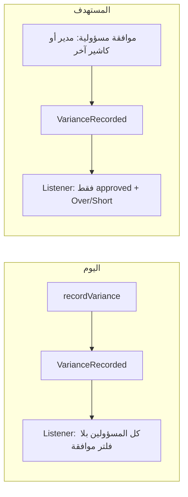

# خطة: الهاند أوفر، إعادة الشيفت، والفارينس في العهدة

## الوضع الحالي (ملخص من الكود)

- **قبول هاند أوفر من كاشير لكاشير**: `[HandoverService::acceptHandoverByCashier](Modules/Shift/app/Services/HandoverService.php)` يحدّث `ShiftHandoverStatus` إلى `ACCEPTED` ولا يضبط `[CashierShift](Modules/Shift/app/Models/CashierShift.php)` إلى `completed` — بينما قبول المدير في `[approveHandover](Modules/Shift/app/Services/HandoverService.php)` يضبط `status` إلى `COMPLETED`.
- **رفض هاند أوفر** (كاشير مستلم أو مدير عبر `[ShiftHandoverController::rejectHandover](Modules/Shift/app/Http/Controllers/ShiftHandoverController.php)`): يحدّث حالة الهاند أوفر فقط ولا يعيد الشيفت إلى `in_progress` ولا يصفّر المبيعات/التحصيل/الهاند أوفر.
- **مسار «My shift» للبرانش مانجر**: `[BranchManagerShiftController::approveHandoff](Modules/Shift/app/Http/Controllers/BranchManagerShiftController.php)` / `[rejectHandoff](Modules/Shift/app/Http/Controllers/BranchManagerShiftController.php)` يحدّثان جدول `[cashier_shift_handovers](Modules/Shift/app/Models/CashierShiftHandover.php)` فقط و**لا** يزامنان `[shift_handover_status](Modules/Shift/app/Models/ShiftHandoverStatus.php)` ولا `CashierShift.status` — بعكس مسار `[HandoverService::approveHandover](Modules/Shift/app/Services/HandoverService.php)` الذي يكمل الشيفت ويُطلق أحداث العهدة و`VarianceRecorded`.
- **الفارينس والعهدة**: `[CreateCustodyLedgerEntriesForVariance](Modules/Custody/app/Listeners/CreateCustodyLedgerEntriesForVariance.php)` يمر على كل `ShiftVarianceDetail` ذي `responsible_cashier_id` **دون** التحقق من `responsibility_status === approved`، فيُنشئ حركات لكاشيرين ما زالوا `pending`. كما أن `VarianceCalculationService::recordVariance` يطلق `VarianceRecorded` مباشرة بعد التسجيل (`[dispatchVarianceRecorded](Modules/Shift/app/Services/VarianceCalculationService.php)`) أي قبل أي «قبول». المعاملة حالياً **دائماً** `is_cash_in = false` (خصم).

---

## 1) الهاند أوفر: قبول = مكتمل، رفض = إعادة تشغيل نهاية الشيفت

**أ) قبول هاند أوفر (كاشير → كاشير)**

- في `[HandoverService::acceptHandoverByCashier](Modules/Shift/app/Services/HandoverService.php)`: بعد نجاح المعاملة، تحديث `CashierShift` إلى `ShiftStatus::COMPLETED` (بنفس روح `approveHandover` للمدير)، مع تسجيل history مناسب.
- التأكد أن منطق فتح رصيد الشيفت التالي (`opening_balance`) يبقى كما هو.

**ب) رفض هاند أوفر** (المستلم كاشير، أو المدير عبر `rejectHandover` — مع مراعاة **الرفض الأول** مقابل `rejected_final`)  
استخراج منطق إلى دالة مركزية في `HandoverService` (مثلاً `revertCashierShiftAfterHandoverRejection`) تُستدعى من:

- `[rejectHandoverByCashier](Modules/Shift/app/Services/HandoverService.php)`
- `[rejectHandover](Modules/Shift/app/Services/HandoverService.php)` عندما يكون الرفض يسمح بإعادة الإرسال (`can_cashier_edit` / ليس `rejected_final`) — **يحتاج تأكيد منتج**: هل الإرجاع لـ `in_progress` مطلوب أيضاً عند `rejected_final`؟ الافتراض في الخطة: **فقط عند الرفض القابل للتصحيح**؛ إن أردتم دائماً حتى النهائي نطبّق نفس الإرجاع.

**محتوى الإرجاع (مطابقة لطلبكم «أصفار كأنه اند شيفت من جديد»)** على `[CashierShift](Modules/Shift/app/Models/CashierShift.php)`:

- `status` → `IN_PROGRESS`
- تصفير أو إلغاء: `total_sales`, `net_sales`, `vat_amount`, `cash_collected`, `card_payments`, `pos_receipt`, `closing_balance`, `expected_balance`, `variance`, `handed_over_at`, `handover_notes`, `next_cashier_id`, `actual_end_time` (أو حسب ما يعرّفه المنتج كـ «لم يُغلق بعد»)
- حذف صفوف `[ShiftSalesBreakdown](Modules/Shift/app/Models/ShiftSalesBreakdown.php)` المرتبطة بالشيفت
- إعادة تعيين أو حذف سجل `[CashierShiftHandover](Modules/Shift/app/Models/CashierShiftHandover.php)` و`[ShiftHandoverStatus](Modules/Shift/app/Models/ShiftHandoverStatus.php)` لهذا الشيفت بحيث يمكن تسجيل هاند أوفر جديد من دون تعارض (إما حذف + إعادة إنشاء عند `recordHandover`، أو أعمدة `pending` — الأبسط: حذف السجلات المرتبطة بالشيفت ضمن نفس transaction)
- حذف `[ShiftVarianceDetail](Modules/Shift/app/Models/ShiftVarianceDetail.php)` (والتنبيهات المرتبطة إن لزم) لأن نهاية الشيفت أُلغيت منطقياً

**عهدة مرتبطة بالشيفت** (`[CashierCustodyTransaction](Modules/Custody/app/Models/CashierCustodyTransaction.php)`): حذف/عكس الحركات المرتبطة بـ `related_shift_id` (أنواع مثل `Total Sales`, `Handover Sent`, `Handover Received`, `Variance`) و`related_handover_id` إن وُجد، حتى لا يبقى رصيداً من جلسة أُلغيت. يفضّل تجميع ذلك في خدمة عهدة صغيرة أو method على `CashierCustodyService` لتفادي تكرار.

**ج) توحيد مسار البرانش مانجر (`approveHandoff` / `rejectHandoff`)**

- **الخيار الموصى به**: جعل `approveHandoff` يستدعي `[HandoverService::approveHandover](Modules/Shift/app/Services/HandoverService.php)` (مع `CashierShift` المحمّل من `handover->cashier_shift_id`) بدلاً من تكرار تحديث `cashier_shift_handovers` فقط — لضمان: `ShiftHandoverStatus`, `COMPLETED`, `HandoverApproved`, `recordHandoverSent`, و`VarianceRecorded` كما في المسار الحالي.
- **رفض**: استدعاء نفس منطق الإرجاع أعلاه + تحديث صف الهاند أوفر وحالة الرفض (ومزامنة `shift_handover_status` إن لزم) بدلاً من `[rejectHandoff](Modules/Shift/app/Http/Controllers/BranchManagerShiftController.php)` الحالي الذي لا يلمس `shift_handover_status`.

بعد التعديل: `[BranchManagerShiftService::clearShiftCaches](Modules/Shift/app/Services/BranchManagerShiftService.php)` يُستدعى بعد الرفض/القبول كما في المسار الحالي.

---

## 2) الفارينس والعهدة: قبول المسؤولية + Over vs Short + الآخرون

**أ) متى تُنشأ حركات العهدة**

- في `[CreateCustodyLedgerEntriesForVariance](Modules/Custody/app/Listeners/CreateCustodyLedgerEntriesForVariance.php)`: اعتبار `**responsibility_status === 'approved'` فقط لكل `ShiftVarianceDetail` قبل إنشاء `CashierCustodyTransaction`.
- تقليل الضوضاء: إزالة أو تعطيل `[dispatchVarianceRecorded](Modules/Shift/app/Services/VarianceCalculationService.php)` من نهاية `recordVariance` إن كان الهدف أن **القيود تظهر فقط بعد الموافقة**؛ الإبقاء على الأحداث من `[ShiftVarianceController::approveResponsibility](Modules/Shift/app/Http/Controllers/ShiftVarianceController.php)` و`[cashierApproveResponsibility](Modules/Shift/app/Http/Controllers/ShiftVarianceController.php)` و`[HandoverService::approveHandover](Modules/Shift/app/Services/HandoverService.php)` لإعادة بناء القيود عند الحاجة.
- عند إعادة الحساب، الإبقاء على `removeExistingVarianceLedgerEntriesForShift` ثم إعادة إنشاء **فقط** للصفوف المعتمدة.

**ب) اتجاه الحركة حسب نوع الفارينس** (اخترتَ «split by type» — اقتراح افتراضي للتنفيذ، قابل للتعديل بجملة ثوابت في المستمع):

- `**SHORT`**: المسؤول يغطي النقص → **Cash OUT (`is_cash_in = false`) بمبلغ `assigned_amount` (منطق قريب من الحالي).
- `**OVER`**: الزيادة تُنسب للمسؤول → **Cash IN (`is_cash_in = true`) بمبلغ `assigned_amount` (يطابق طلب «يزيد في العهدة» لسيناريو الزيادة).

**ج) مدير الفرع في `PersonalLedgerTransaction`**

- تعديل `[createBranchManagerVarianceEntry](Modules/Custody/app/Listeners/CreateCustodyLedgerEntriesForVariance.php)` ليستخدم **فقط** التفاصيل المعتمدة، ويحسب المجاميع بشكل متسق مع Over/Short (مثلاً صافي يعكس ما يدخل/يخرج من الكاشيرين — التفاصيل الدقيقة تُراجع معكم عند التنفيذ إن اختلفت السياسة المحاسبية).

**د) كاشير «آخر» وافق**

- `[cashierApproveResponsibility](Modules/Shift/app/Http/Controllers/ShiftVarianceController.php)` يطلق `VarianceRecorded` بالفعل؛ بعد فلترة `approved`، سيُنشأ قيد **لذلك الكاشير فقط** عند اعتماد سجله، دون انتظار بقية المسؤولين — وهذا يطابق «لو وافقوا يتضاف في محفظتهم».

---

## 3) اختبارات وتحقق

- Feature tests (أو وحدات خدمة) لـ: رفض هاند أوفر → `in_progress` + أعمدة مالية 0 + لا حركات عهدة متبقية للشيفت.
- قبول هاند أوفر كاشير → `completed`.
- موافقة هاند أوف من `BranchManagerShiftController` تمر بنفس نتيجة `HandoverService::approveHandover`.
- تسجيل فارينس ثم موافقة جزئية (كاشير واحد من عدة) → قيود عهدة لذلك الكاشير فقط؛ موافقة الباقي لاحقاً تضيف قيودهم.

---

## ملفات رئيسية للمس

- `[Modules/Shift/app/Services/HandoverService.php](Modules/Shift/app/Services/HandoverService.php)`
- `[Modules/Shift/app/Http/Controllers/BranchManagerShiftController.php](Modules/Shift/app/Http/Controllers/BranchManagerShiftController.php)`
- `[Modules/Custody/app/Listeners/CreateCustodyLedgerEntriesForVariance.php](Modules/Custody/app/Listeners/CreateCustodyLedgerEntriesForVariance.php)`
- `[Modules/Custody/app/Services/CashierCustodyService.php](Modules/Custody/app/Services/CashierCustodyService.php)` (تنظيف حركات مرتبطة بالشيفت)
- `[Modules/Shift/app/Services/VarianceCalculationService.php](Modules/Shift/app/Services/VarianceCalculationService.php)` (توقيت `VarianceRecorded`)
- اختبارات تحت `[Modules/Shift/tests](Modules/Shift/tests)` أو `[tests/Feature](tests/Feature)` حسب هيكل المشروع
