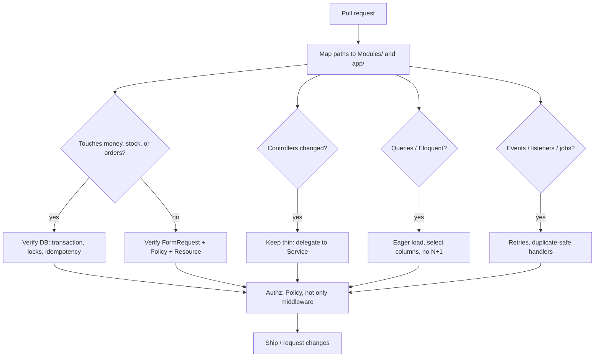
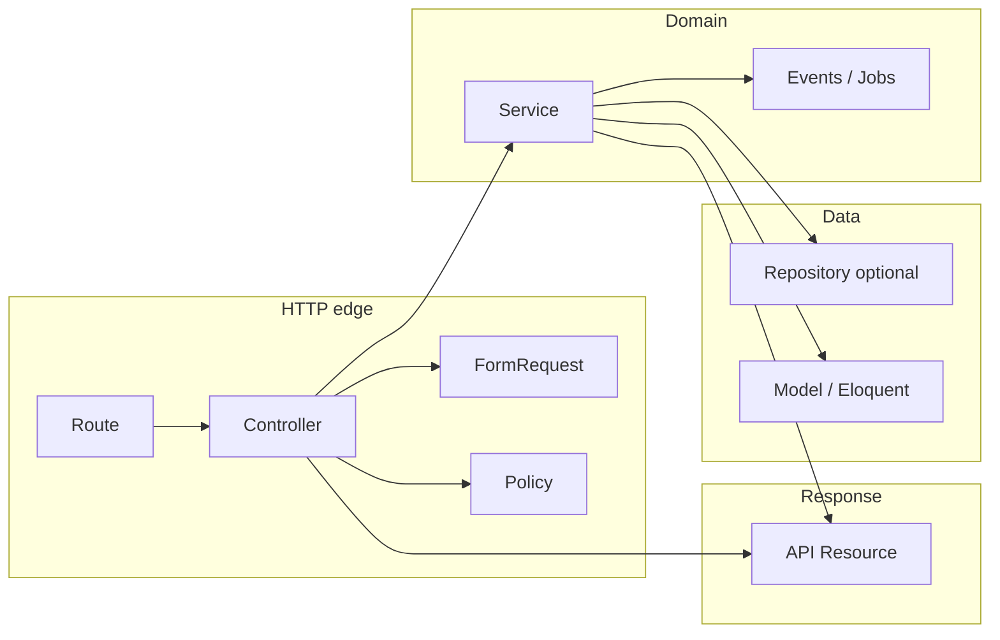
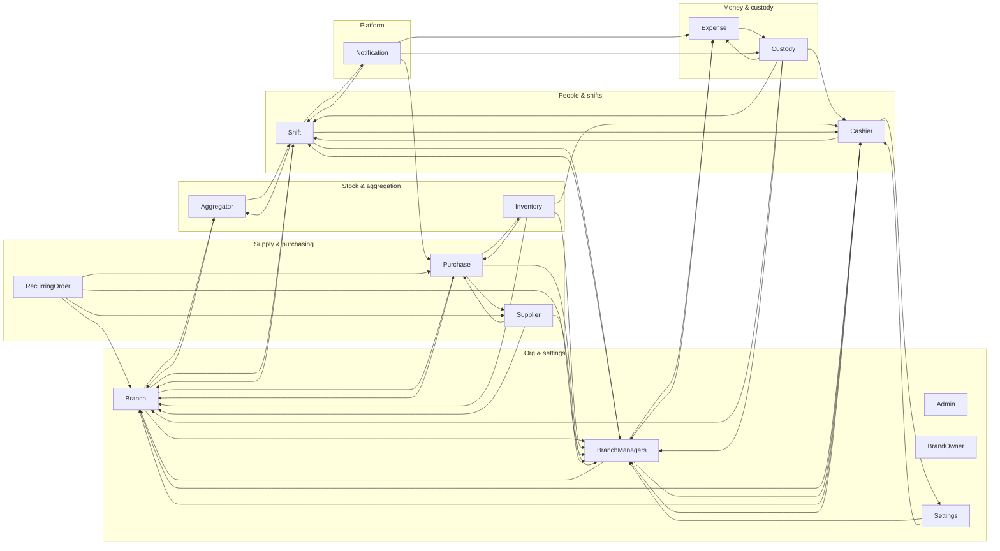

# Assab — Code review graph

Living reference for **what to review** and **how modules depend on each other**.  
Regenerate the machine-readable edge list with:

```bash
php scripts/build-module-dependency-graph.php
```

Edges are derived from `use Modules\{Name}\...` statements under `Modules/` (PHP imports only; runtime bindings may add more).

---

## 1. Review workflow (decision graph)

Use this to route a PR through the right checks (aligns with `.cursor/rules/my-custom-rule.mdc` and module contracts under `specs/`).



**Report template** for cross-module performance reviews:  
[`specs/001-modules-n1-query/contracts/review-report.md`](../specs/001-modules-n1-query/contracts/review-report.md)

---

## 2. Request / layer architecture (review lens)

Expected shape inside each module:



---

## 3. Module coupling graph (import-level)

**Active modules** (from `modules_statuses.json`):  
Admin, Aggregator, Branch, BranchManagers, BrandOwner, Cashier, Custody, Expense, Inventory, Notification, Purchase, RecurringOrder, Settings, Shift, Supplier.

Arrows: **A --> B** means code in module **A** imports types from module **B** (`use Modules\B\...`).



> **Note:** `Admin` and `BrandOwner` are included as modules but had **no cross-module `use` edges** in the last scan—they may still depend on `app/` or Laravel only.

**Hub modules** (many incoming arrows): `Branch`, `BranchManagers`, `Purchase`, `Cashier`. Changes there merit wider regression and contract checks.

---

## 4. Notification & domain events (review hotspot)

`Notification` subscribes to events from **Shift**, **Expense**, **Custody**, and **Purchase** (see `Modules/Notification/app/Providers/EventServiceProvider.php`).  
When editing those domains, verify listener side effects, failure handling, and duplicate deliveries.

---

## 5. Quick module → review focus

| Module        | Typical review focus                                              |
|---------------|-------------------------------------------------------------------|
| Purchase      | Order state, timelines, N+1 on lists, supplier/item graphs      |
| Inventory     | Stock math, sessions, coupling to `Purchase` models             |
| Shift         | Variance, custody handoffs, `Notification` / `Aggregator` ties  |
| Custody       | Ledger consistency, transactions, Expense / Shift integration   |
| RecurringOrder| Jobs, idempotency, `Purchase` creation side effects             |
| Supplier      | Portal auth, order APIs, `Purchase` transformers                |
| Notification  | Channel failures, preference rules, event payload stability       |
| Expense       | Approval flows, custody links, branch manager scoping             |

---

## Appendix: current edge list (regenerate with script)

```
Aggregator=>Branch
Aggregator=>Shift
Branch=>Aggregator
Branch=>BranchManagers
Branch=>Cashier
Branch=>Purchase
Branch=>Shift
BranchManagers=>Branch
BranchManagers=>Cashier
BranchManagers=>Expense
BranchManagers=>Shift
Cashier=>Branch
Cashier=>BranchManagers
Cashier=>Settings
Cashier=>Shift
Custody=>Branch
Custody=>BranchManagers
Custody=>Cashier
Custody=>Expense
Custody=>Shift
Expense=>BranchManagers
Expense=>Custody
Inventory=>Branch
Inventory=>BranchManagers
Inventory=>Cashier
Inventory=>Purchase
Notification=>Custody
Notification=>Expense
Notification=>Purchase
Notification=>Shift
Purchase=>Branch
Purchase=>BranchManagers
Purchase=>Inventory
Purchase=>Supplier
RecurringOrder=>Branch
RecurringOrder=>BranchManagers
RecurringOrder=>Purchase
RecurringOrder=>Supplier
Settings=>BranchManagers
Settings=>Cashier
Shift=>Aggregator
Shift=>Branch
Shift=>BranchManagers
Shift=>Cashier
Shift=>Notification
Supplier=>Branch
Supplier=>BranchManagers
Supplier=>Purchase
```

When coupling changes, update **section 3** and this appendix after running `php scripts/build-module-dependency-graph.php`.
